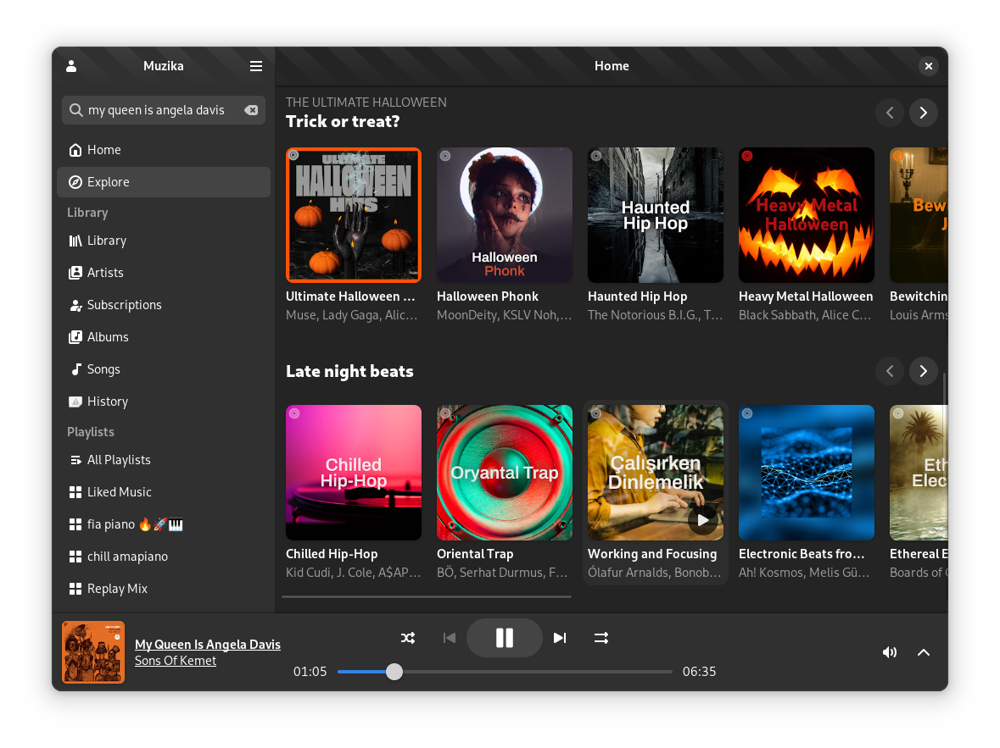
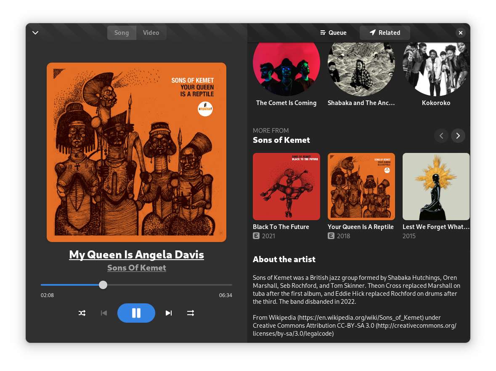

# Muzika

Muzika is an elegant music streaming app.





> Note: This is a work in progress. The app is not yet ready for production.

## Features

- Personalized home screen
- Search for songs, albums, artists, radios and playlists
- Login with Google and access your playlists and more from your library
- Play personalized radios & mixes
- View song lyrics & related information
- Browse artists, albums and playlists etc.

## Installation

### Using the latest Nightly Flatpak

You can download the [latest Nightly flatpak](https://vixalien.github.io/muzika/muzika.flatpakref).

### From source

Dependencies:

- GNOME Builder

1. Clone the repository

```bash
git clone https://github.com/vixalien/muzika.git --recurse-submodules
```

2. Open the project in GNOME Builder and use "Build" to build the project.

> Note: Using Meson and Ninja directly is no longer supported because Muzika
> uses the latest (unreleased) libadwaita components.

## Navigation

Muzika has a robust navigator that allows you to navigate through different
pages by using muzika URIs. Some of them are documented below.

The muzika URI has the form `muzika:endpoint:data`. URIs can also have query
parameters. For example, `muzika:library?view=grid` will open the library page
with the grid view.

You can navigate to a muzika URI by directly typing it in the search bar and
muzika will visit that page directly instead of searching it.

You can also navigate to a given endpoint by triggering the navigator action
manually:

1. Open the GTK inspector by pressing `Ctrl+Shift+I`.
2. Click on the `Actions` tab on the right.
3. Look for the action named `navigator.visit` and type in your URI in the
   `Parameter` field, then click `Activate`.

### Endpoints

A list of all endpoints are [here](src/pages.ts).

- `muzika:home` - Home page
- `muzika:playlist:<playlistId>` - Playlist page. eg:
  `muzika:playlist:PL4fGSI1pDJn6puJdseH2Rt9sMvt9E2M4i`/
- `muzika:album:<albumId>` - Album page.
- `muzika:artist:<channelId>` - Artist or Channel page.
- `search:<query>` - Search. Note that query must be URL encoded. eg:
  `search:hello%20world` searches for `hello world`.
- `muzika:library` - Library.

More endpoints will be added as Muzika supports more features.
